# ProFolio

ProFolio is a mobile career companion built with Flutter and Supabase. It brings together your professional profile, resume, and AI-powered job discovery in one place — build your profile, get Gemini-recommended job listings tailored to your skills, apply and track applications, and stay on top of it all with a notification center and configurable settings.

## Overview

ProFolio helps job seekers manage their entire application pipeline without juggling multiple tools:

- Maintain a rich profile (education, experience, certifications, skills, languages) and a resume, backed by Supabase Postgres + Storage.
- Get AI-generated, personalized job recommendations from Google's Gemini API, filtered by tab (Recommended, Latest, Remote, Full-Time, Part-Time, Internship) without re-querying Gemini on every tab switch.
- Apply to jobs in-app and track application status (Pending / Applied / Accepted / Rejected), plus a Saved Jobs list.
- Receive job alerts, recommendations, and application status updates through an in-app notification center and local device notifications.
- Manage account settings: password changes, notification preferences, and profile visibility.

## Features

- **Authentication** — Email/password sign-up, sign-in, and password reset via Supabase Auth.
- **Profile management** — Editable profile with education, experience, certifications, skills, languages, and a profile photo (Supabase Storage).
- **Resume management** — Upload, preview, and replace a resume (PDF/DOCX) with signed-URL access from private storage.
- **AI job matching** — Gemini-generated job listings personalized to your profile, cached in memory for the session so switching tabs filters locally instead of triggering new API calls.
- **Job search & filters** — Search by keyword, filter by category/experience level/salary range, and browse by tab.
- **Apply & track** — Submit applications with your resume attached, then track status changes across Pending, Applied, Accepted, and Rejected.
- **Saved jobs** — Bookmark jobs to review or apply to later.
- **Notification center** — In-app history of job alerts, recommendations, and status updates, mirrored as local system notifications, with an unread-count badge on the dashboard.
- **Settings** — Change password, toggle notification preferences per category, control profile visibility, and log out.
- **Polished UI** — Shimmer loading skeletons, friendly error states with retry, smooth page transitions, and a consistent cream/navy/bronze theme throughout.

## Tech Stack

- **[Flutter](https://flutter.dev/)** — cross-platform UI toolkit (Dart)
- **[Riverpod](https://riverpod.dev/)** — state management
- **[Supabase](https://supabase.com/)** — Postgres database, Auth, Storage, and Row Level Security
- **[Google Gemini API](https://ai.google.dev/)** (`google_generative_ai`, `gemini-2.5-flash`) — AI-generated job recommendations
- **flutter_local_notifications** — local/system notifications
- **shimmer** — loading skeletons
- **google_fonts** (Playfair Display + Inter) — typography
- **flutter_launcher_icons** / **flutter_native_splash** — app icon and splash screen

## Screenshots

### Authentication

<table>
  <tr>
    <td>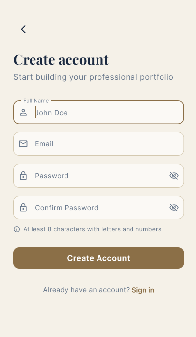</td>
    <td>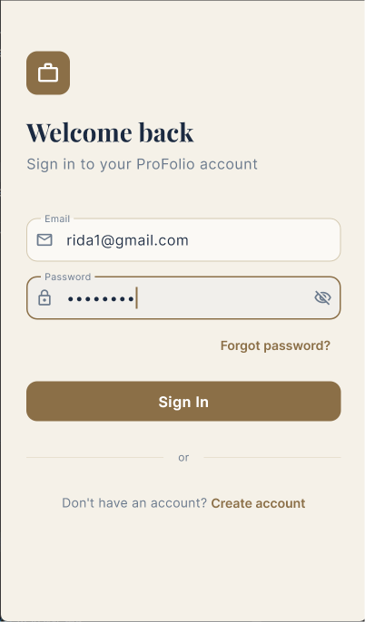</td>
    <td>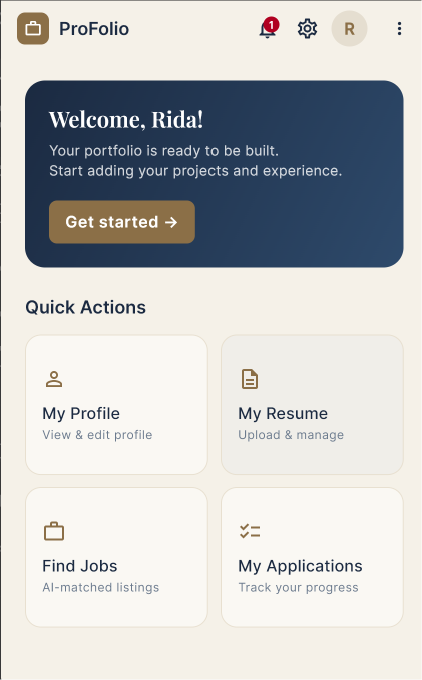</td>
  </tr>
</table>

### Profile

<table>
  <tr>
    <td>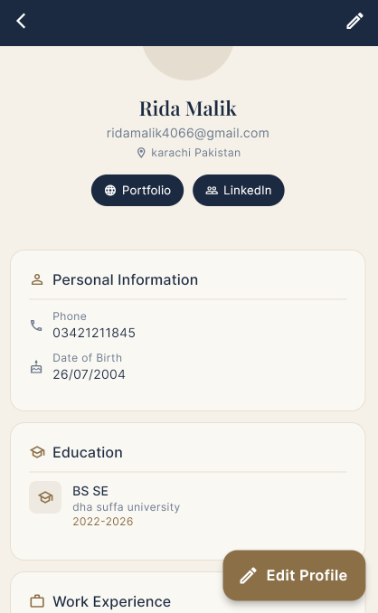</td>
    <td>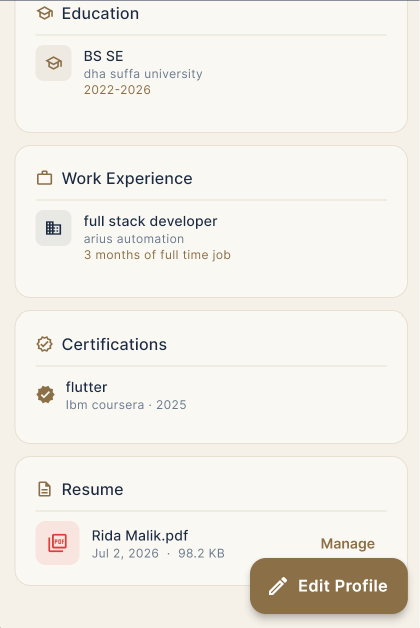</td>
    <td>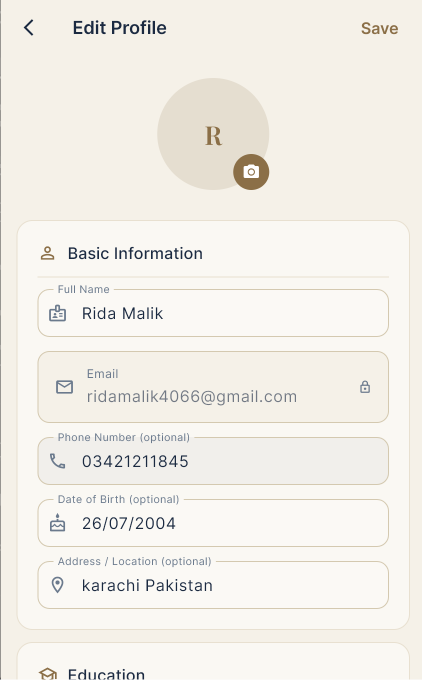</td>
  </tr>
  <tr>
    <td>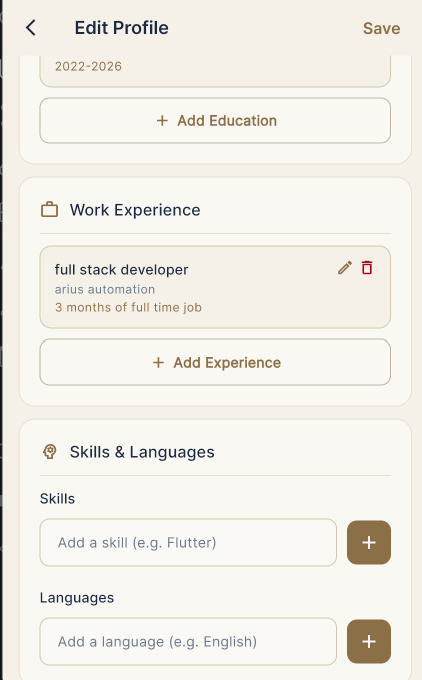</td>
    <td>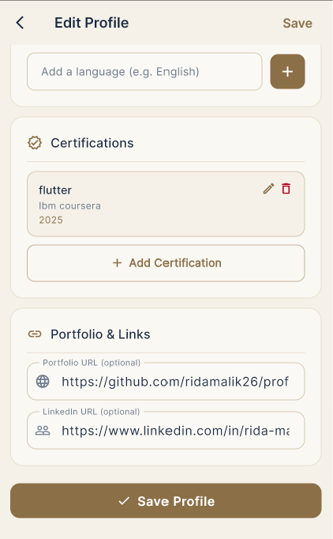</td>
    <td>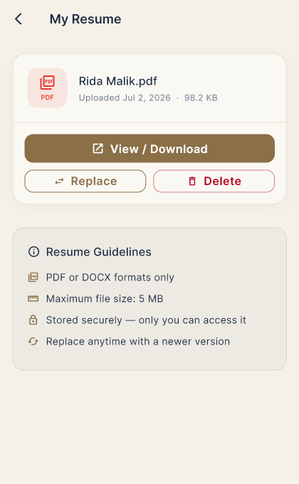</td>
  </tr>
</table>

### Jobs

<table>
  <tr>
    <td>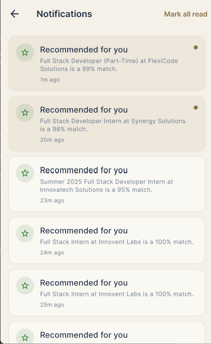</td>
    <td>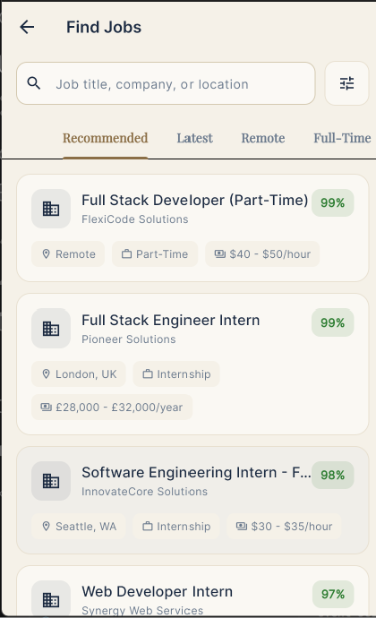</td>
    <td>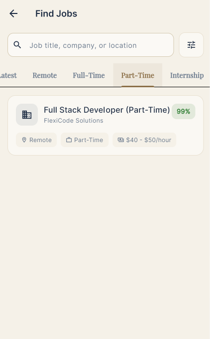</td>
  </tr>
  <tr>
    <td>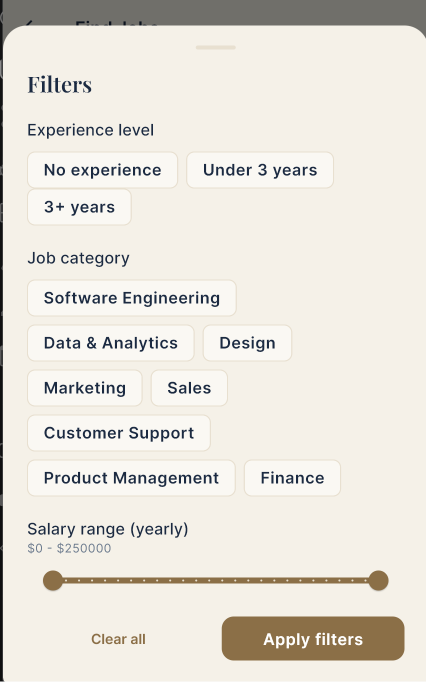</td>
    <td>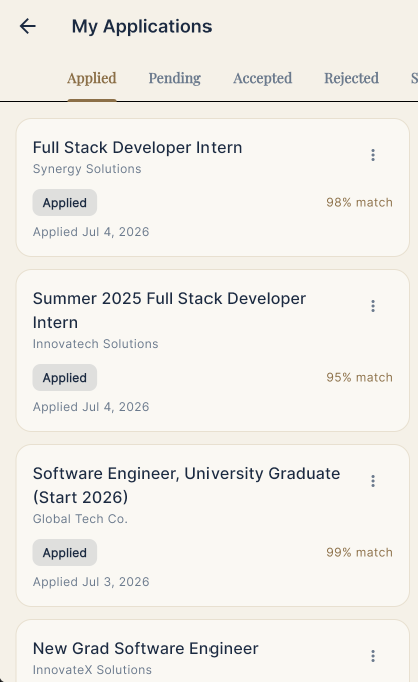</td>
  </tr>
</table>

### Settings

<table>
  <tr>
    <td>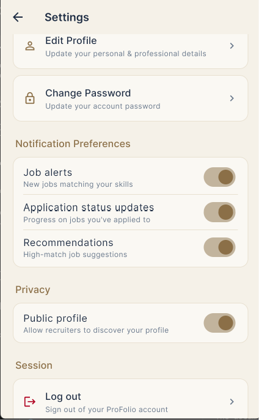</td>
    <td>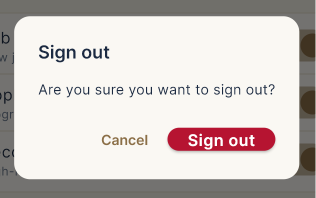</td>
  </tr>
</table>

## Setup Instructions

### Prerequisites

- [Flutter SDK](https://docs.flutter.dev/get-started/install) (channel stable; see `environment.sdk` in `pubspec.yaml` for the exact constraint)
- A [Supabase](https://supabase.com/) project
- A [Google Gemini API](https://ai.google.dev/) key
- (Optional, for real job search results) A JSearch API key via [RapidAPI](https://rapidapi.com/)

### 1. Clone and install dependencies

```bash
git clone <this-repo-url>
cd ProFolio
flutter pub get
```

### 2. Configure environment variables

Create a `.env` file in the project root (already listed as a Flutter asset in `pubspec.yaml`):

```
SUPABASE_URL=https://<your-project-ref>.supabase.co
SUPABASE_ANON_KEY=<your-supabase-anon-key>
GEMINI_API_KEY=<your-gemini-api-key>
JSEARCH_API_KEY=<your-jsearch-api-key>
```

The Supabase anon key is safe to ship in the client — access is enforced by Row Level Security policies, not by keeping this key secret.

### 3. Set up the Supabase database

Run the SQL migrations in `supabase/migrations/` against your Supabase project, in order, via the Supabase SQL editor (or `supabase db push` if you have the CLI linked). Alternatively, run **`database_export.sql`** in the project root — a consolidated, idempotent snapshot that creates all tables (`users`, `applications`, `saved_jobs`, `notifications`), indexes, and RLS policies in one pass.

This also creates the storage buckets used for avatars (public) and resumes (private).

### 4. Run the app

```bash
flutter run
```

### 5. Build a release APK

```bash
flutter build apk --release
```

The output APK is written to `build/app/outputs/flutter-apk/app-release.apk`.

## Project Structure

```
lib/
  core/            # theme, colors, validators, exceptions, page transitions
  models/           # data models (profile, job, application, notification, settings, ...)
  services/         # Supabase/Gemini/notification service classes
  providers/        # Riverpod providers and state notifiers
  screens/          # feature screens (auth, profile, resume, jobs, tracking, notifications, settings)
  widgets/          # shared widgets (buttons, text fields, shimmer skeletons, error banners)
supabase/
  migrations/       # incremental SQL migrations (source of truth)
database_export.sql # consolidated schema snapshot (tables + RLS)
```
